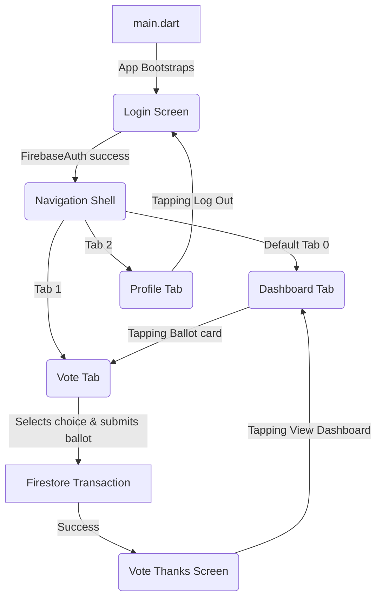

# CivicVote - Complete Codebase & Architecture Documentation

Welcome to the comprehensive documentation for **CivicVote**, a secure, decentralized-ledger-inspired digital voting application. This documentation is structured to guide a new developer from high-level architecture down to the exact variables and functions that run the app.

---

## 1. Project Overview

### Purpose
CivicVote is a mobile and web application designed for secure, transparent, and democratic precinct-level voting. It allows registered electors to authenticate, view live turnout statistics, review candidates representing their district, cast a single cryptographic ballot, and view their ballot receipt.

### Main Features
1. **Precinct-Based Authentication**: Secure sign-in using a unique 12-digit Voter ID and 11-character password.
2. **Live Election Dashboard**: Displays total turnout count, turnout percentage, and regional (precinct) voting statistics, updating in real time.
3. **Active Voting Countdown**: Real-time timer showing time remaining until voting closes, synchronized with database configuration.
4. **Secure Ballot Submission**: Atomic transaction-based voting which guarantees single-vote integrity (prevents double-voting) and increments candidate tallies safely.
5. **Immutable Ballot Audit Log**: Writes voter selections to a secure `votes` collection which is locked against updates and deletes via database security rules.
6. **Precinct Isolation**: Automatically pulls candidates registered under the voter's specific constituency.
7. **Premium Dark Theme**: Seamless glassmorphic cards, custom typography, glowing brand accents, and micro-animations.

### Architecture Pattern
CivicVote utilizes a flat **MVVM (Model-View-ViewModel)** inspired architecture combined with **Service-driven patterns**:
* **View (UI)**: Built with Flutter's reactive widget system. The screens (`dashboard_screen.dart`, `vote_screen.dart`, etc.) bind directly to database streams or change notifier state.
* **ViewModel / State**: Singletons like `ElectionTimeManager` manage global lifecycle state and dispatch updates via `ChangeNotifier`.
* **Services**: Modular helper classes like `VotingAnalyticsService` encapsulate business logic, Firestore aggregation queries, and calculations.
* **Data Layer (Firebase)**: Cloud Firestore is treated as the single source of truth, utilizing database streams to bypass complex local state synchronization.

*Why this architecture is used:* 
As a pilot project, keeping a flat folder structure inside `/lib` reduces cognitive overhead and makes the codebase highly readable. However, using services and transaction layers ensures that business logic remains robust, secure, and ready to be refactored into a full-scale modular architecture.

---

## 2. Folder Structure Analysis

The project layout is flat inside the `/lib` directory to keep file access simple for developers. Here is how the workspace is structured:

```
civic_vote/
├── lib/                             # Core Flutter Application Code
│   ├── dashboard_screen.dart        # Dashboard screen showing turnout & results
│   ├── election_time_manager.dart   # Singleton managing countdown timers & status
│   ├── firebase_options.dart        # Firebase credential configurations
│   ├── live_update.dart             # UI Blinker showing active connection state
│   ├── login_screen.dart            # Entrance authentication screen
│   ├── main.dart                    # Application entry point
│   ├── navigation_shell.dart        # Tab-routing shell and main navigation bar
│   ├── profile2.dart                # Redundant/Mock profile screen (Sandbox file)
│   ├── profile_screen.dart          # Real profile & settings screen
│   ├── theme.dart                   # Global colors, typography, styles
│   ├── vote_screen.dart             # Ballot card and candidate selection screen
│   ├── vote_thanks_screen.dart      # Thank you screen & selection receipt
│   └── voting_analytics_services.dart# Aggregator queries for turnout analytics
├── assets/                          # Static assets (images, app icons)
├── firestore.rules                  # Security rules for Firestore collections
├── firebase.json                    # Configuration for Firebase CLI & local hosting
└── pubspec.yaml                     # Dependency manifest file
```

### Folder Name: `lib/`
* **Purpose**: Houses the entire source code of the Flutter application.
* **Contains**: All 13 `.dart` files detailed above.
* **Dependencies**: Relies on external packages declared in `pubspec.yaml` (e.g. `firebase_core`, `cloud_firestore`, `google_fonts`).

---

## 3. File-by-File Documentation

### 1. `main.dart`
* **Location**: [lib/main.dart](file:///c:/Learning%20some%20new%20stuff/App%20Development/civic_vote/lib/main.dart)
* **Purpose**: Entry point of the application. Initializes bindings, bootstraps Firebase, sets up global Material 3 theme properties, and opens the initial screen.
* **Used By**: Called by Flutter engine on startup.
* **Dependencies**: `flutter/material.dart`, `firebase_core`, `firebase_options.dart`, `civicvote/theme.dart`, `civicvote/login_screen.dart`.
* **Workflow**:
  1. Operating system starts application.
  2. `main()` is executed asynchronously.
  3. `WidgetsFlutterBinding.ensureInitialized()` guarantees native communication channels are established.
  4. Firebase is initialized via `Firebase.initializeApp()`.
  5. `runApp()` inflates `MyApp` widget, setting theme configurations and launching `LoginScreen`.

### 2. `theme.dart`
* **Location**: [lib/theme.dart](file:///c:/Learning%20some%20new%20stuff/App%20Development/civic_vote/lib/theme.dart)
* **Purpose**: Holds design tokens: colors, typography (Google Fonts `Manrope` for headings, `Hanken Grotesk` for labels/body), and glassmorphic card decorations.
* **Used By**: Imported by almost all UI files to maintain consistent styling.
* **Dependencies**: `flutter/material.dart`, `google_fonts`.
* **Workflow**: Static definition file. Rebuilt only during compilation. Used statically on widget generation.

### 3. `login_screen.dart`
* **Location**: [lib/login_screen.dart](file:///c:/Learning%20some%20new%20stuff/App%20Development/civic_vote/lib/login_screen.dart)
* **Purpose**: Provides a secure portal login. Validates format inputs and authenticates users via Firebase Auth.
* **Used By**: Called as the default landing route by `main.dart` or during logout sequences from `profile_screen.dart`.
* **Dependencies**: `flutter/material.dart`, `firebase_auth.dart`, `civicvote/theme.dart`, `civicvote/navigation_shell.dart`.
* **Workflow**:
  1. User enters 12-digit Voter ID and password.
  2. Form triggers input validators.
  3. App formats the Voter ID into a system email: `$voterId@civicvote.app`.
  4. Firebase Auth validates credentials.
  5. Upon success, navigates to `NavigationShell` and clears the routing stack.

### 4. `navigation_shell.dart`
* **Location**: [lib/navigation_shell.dart](file:///c:/Learning%20some%20new%20stuff/App%20Development/civic_vote/lib/navigation_shell.dart)
* **Purpose**: Houses the bottom navigation bar and coordinates screen-swapping between the Dashboard, Vote, and Profile tabs. Uses a real-time Firestore stream to pass critical voter flags (`hasVoted`, `constituencyId`) to child tabs.
* **Used By**: Navigation target of `login_screen.dart`.
* **Dependencies**: `flutter/material.dart`, `cloud_firestore.dart`, `civicvote/theme.dart`, `civicvote/dashboard_screen.dart`, `civicvote/vote_screen.dart`, `civicvote/profile_screen.dart`.
* **Workflow**:
  1. Screen loads and initiates a Firestore listener on `voters/$voterId`.
  2. Stream yields documents containing voter attributes.
  3. UI generates tabs passing updated database parameters.
  4. User taps bottom bar, updating `_currentIndex` and reloading the active view tab.

### 5. `dashboard_screen.dart`
* **Location**: [lib/dashboard_screen.dart](file:///c:/Learning%20some%20new%20stuff/App%20Development/civic_vote/lib/dashboard_screen.dart)
* **Purpose**: The primary statistics landing pad. Displays live vote counts, overall turnout percentage, precinct-based results, countdown timer, and personal ballot status.
* **Used By**: Tab 0 of `navigation_shell.dart`.
* **Dependencies**: `flutter/material.dart`, `cloud_firestore.dart`, `civicvote/theme.dart`, `civicvote/live_update.dart`, `civicvote/voting_analytics_services.dart`, `civicvote/election_time_manager.dart`.
* **Workflow**:
  1. Infills total votes cast from Firestore.
  2. Triggers `VotingAnalyticsService` to load analytics maps asynchronously.
  3. Listens to `ElectionTimeManager` timer ticks (Note: contains listener registration bug).
  4. Updates dropdown selectors to pull candidates dynamically for the user's selected constituency.

### 6. `vote_screen.dart`
* **Location**: [lib/vote_screen.dart](file:///c:/Learning%20some%20new%20stuff/App%20Development/civic_vote/lib/vote_screen.dart)
* **Purpose**: Handles ballot display, option selection, and transaction execution.
* **Used By**: Tab 1 of `navigation_shell.dart`.
* **Dependencies**: `flutter/material.dart`, `cloud_firestore.dart`, `firebase_auth.dart`, `civicvote/theme.dart`, `civicvote/vote_thanks_screen.dart`, `civicvote/election_time_manager.dart`.
* **Workflow**:
  1. Checks if `hasVoted` is true. If yes, builds `VoteThanksScreen`.
  2. If false, streams candidate lists for `constituencyId`.
  3. Voter selects a candidate card and clicks "Submit Private Ballot".
  4. Triggers atomic Firestore transaction.
  5. Rebuilds screen into `VoteThanksScreen` upon successful commit.

### 7. `vote_thanks_screen.dart`
* **Location**: [lib/vote_thanks_screen.dart](file:///c:/Learning%20some%20new%20stuff/App%20Development/civic_vote/lib/vote_thanks_screen.dart)
* **Purpose**: Displays a secure confirmation message and selection receipt upon completion of voting.
* **Used By**: Embedded in `vote_screen.dart`.
* **Dependencies**: `flutter/material.dart`, `civicvote/theme.dart`.
* **Workflow**: Inflates once a ballot transaction is resolved or if the voter's database record already has `hasVoted` marked true.

### 8. `profile_screen.dart`
* **Location**: [lib/profile_screen.dart](file:///c:/Learning%20some%20new%20stuff/App%20Development/civic_vote/lib/profile_screen.dart)
* **Purpose**: Displays voter identity details and app configurations, and handles the user sign-out workflow.
* **Used By**: Tab 2 of `navigation_shell.dart`.
* **Dependencies**: `flutter/material.dart`, `cloud_firestore.dart`, `civicvote/theme.dart`, `civicvote/login_screen.dart`.
* **Workflow**: Queries `voters/$voterId` via a `StreamBuilder` and displays the voter's full name alongside app options. Invoking "Log Out" resets the navigation stack back to `LoginScreen`.

### 9. `profile2.dart`
* **Location**: [lib/profile2.dart](file:///c:/Learning%20some%20new%20stuff/App%20Development/civic_vote/lib/profile2.dart)
* **Purpose**: Standalone sandbox duplicate of the Profile Screen featuring dummy data and a local tab bar. Not linked to the main navigation flow.
* **Used By**: Dead code / sandbox file.
* **Dependencies**: `flutter/material.dart`, `google_fonts.dart`, `civicvote/theme.dart`.
* **Workflow**: Evaluated only as a fallback visual mock.

### 10. `election_time_manager.dart`
* **Location**: [lib/election_time_manager.dart](file:///c:/Learning%20some%20new%20stuff/App%20Development/civic_vote/lib/election_time_manager.dart)
* **Purpose**: Singleton ChangeNotifier that pulls election deadline data from Firestore and calculates the active time remaining via a 1-second background timer.
* **Used By**: `dashboard_screen.dart`, `vote_screen.dart`.
* **Dependencies**: `dart:async`, `flutter/material.dart`, `cloud_firestore.dart`.
* **Workflow**:
  1. Initialized as a singleton on first call.
  2. Registers as a `WidgetsBindingObserver` to detect when the app returns from the background.
  3. Queries Firestore `system_config/election_state` for `endTime`.
  4. Runs a periodic `Timer` to decrement `_remaining` every second and dispatches notifications.

### 11. `voting_analytics_services.dart`
* **Location**: [lib/voting_analytics_services.dart](file:///c:/Learning%20some%20new%20stuff/App%20Development/civic_vote/lib/voting_analytics_services.dart)
* **Purpose**: Houses database analytics queries. Performs document count aggregations over the `votes` collection to compute global and precinct-based voter turnout rates.
* **Used By**: `dashboard_screen.dart`.
* **Dependencies**: `cloud_firestore.dart`.
* **Workflow**: Evaluated via Future triggers from the dashboard layout.

### 12. `live_update.dart`
* **Location**: [lib/live_update.dart](file:///c:/Learning%20some%20new%20stuff/App%20Development/civic_vote/lib/live_update.dart)
* **Purpose**: Simple blinking circle widget used to indicate real-time connection state.
* **Used By**: `dashboard_screen.dart`.
* **Dependencies**: `flutter/material.dart`, `civicvote/theme.dart`.
* **Workflow**: Triggers a repeating double animation on load that scales opacity between `1.0` and `0.2` every second.

### 13. `firebase_options.dart`
* **Location**: [lib/firebase_options.dart](file:///c:/Learning%20some%20new%20stuff/App%20Development/civic_vote/lib/firebase_options.dart)
* **Purpose**: Holds project API keys, configuration keys, and database URLs generated by the FlutterFire CLI.
* **Used By**: `main.dart`.
* **Dependencies**: `firebase_core`, `flutter/foundation.dart`.

---

## 4. Class Documentation

### `MyApp`
* **Purpose**: Root application configuration class.
* **Type**: `StatelessWidget`
* **Responsibilities**: Configures app theme, title, and initial route (`LoginScreen`).
* **Lifecycle**: Instantiated once in `main()` and lives for the entire application execution cycle.
* **Relationships**: Parent: `StatelessWidget`. Child: `MaterialApp`.

### `AppColors`
* **Purpose**: Design token class holding application brand and visual color mappings.
* **Type**: `Utility`
* **Responsibilities**: Define absolute Color values.
* **Lifecycle**: Compile-time constant; never instantiated.

### `AppTypography`
* **Purpose**: Design token class mapping semantic text scales to specific Google Fonts properties.
* **Type**: `Utility`
* **Responsibilities**: Holds styles for headlines, labels, and paragraph sizes.
* **Lifecycle**: Compile-time constant; never instantiated.

### `AppDecorations`
* **Purpose**: Custom panel container borders and button glows.
* **Type**: `Utility`
* **Responsibilities**: Generates glassmorphism and shadow decorations.
* **Lifecycle**: Compile-time constant; never instantiated.

### `LoginScreen`
* **Purpose**: Main entrance form screen.
* **Type**: `StatefulWidget`
* **Responsibilities**: Initiates login workflows.
* **Lifecycle**: Lives until auth succeeds.
* **Relationships**: Parent: `StatefulWidget`. Child: `_LoginScreenState`.

### `_LoginScreenState`
* **Purpose**: Form states and submission management for login.
* **Type**: `State`
* **Responsibilities**: Validates inputs, handles loaders, and triggers Firebase Auth requests.
* **Lifecycle**: Extends between widget creation and navigator swaps.

### `NavigationShell`
* **Purpose**: Base tab scaffolding shell.
* **Type**: `StatefulWidget`
* **Responsibilities**: Stream voter metrics, holds appbars, and highlights tab items.
* **Lifecycle**: Created post-auth and disposed upon logout.
* **Relationships**: Parent: `StatefulWidget`. Child: `_NavigationShellState`.

### `_NavigationShellState`
* **Purpose**: State storage for screen tab indices.
* **Type**: `State`
* **Responsibilities**: Swaps body widgets on navigation bar clicks.
* **Lifecycle**: Bound to the parent shell.

### `DashboardScreen`
* **Purpose**: User home page displaying voting statistics.
* **Type**: `StatefulWidget`
* **Responsibilities**: Binds voter parameters.
* **Lifecycle**: Instantiated as a persistent nav tab.
* **Relationships**: Parent: `StatefulWidget`. Child: `_DashboardScreenState`.

### `_DashboardScreenState`
* **Purpose**: State controller for dashboard components.
* **Type**: `State`
* **Responsibilities**: Dropdown filters, layout builders, and metric bindings.
* **Lifecycle**: Exists within active shell navigation.

### `VoteScreen`
* **Purpose**: Handles candidate display cards and ballot submissions.
* **Type**: `StatefulWidget`
* **Responsibilities**: Manages voting interfaces.
* **Lifecycle**: Instantiated as a persistent nav tab.
* **Relationships**: Parent: `StatefulWidget`. Child: `_VoteScreenState`.

### `_VoteScreenState`
* **Purpose**: State controller for selecting and submitting ballots.
* **Type**: `State`
* **Responsibilities**: Tracks choices, blocks double-voting inputs, and triggers transactions.
* **Lifecycle**: Mounts timers on load and clears them on exit.

### `VoteThanksScreen`
* **Purpose**: Renders the receipt details.
* **Type**: `StatelessWidget`
* **Responsibilities**: Renders selection receipts and links back to the dashboard.
* **Lifecycle**: Created on resolution of voting.

### `ProfileScreen`
* **Purpose**: Displays user status and handles sign-out commands.
* **Type**: `StatelessWidget`
* **Responsibilities**: Renders settings grids and redirects stack routing.
* **Lifecycle**: Instantiated as a persistent nav tab.

### `Profile2Screen`
* **Purpose**: Backup static layout mock screen.
* **Type**: `StatefulWidget`
* **Responsibilities**: Renders static UI blocks.
* **Lifecycle**: Non-navigated sandbox.
* **Relationships**: Parent: `StatefulWidget`. Child: `_Profile2ScreenState`.

### `_Profile2ScreenState`
* **Purpose**: Mocks local tab index selections.
* **Type**: `State`
* **Responsibilities**: Local UI bindings.
* **Lifecycle**: Sandboxed.

### `ElectionTimeManager`
* **Purpose**: Singleton manager maintaining election status.
* **Type**: `ChangeNotifier`
* **Responsibilities**: Fetches deadlines, increments timers, notifies widgets, and observes app lifecycle states.
* **Lifecycle**: Bootstrapped once on app start.

### `VotingAnalyticsService`
* **Purpose**: Queries Firestore to compute turnout metrics.
* **Type**: `Service`
* **Responsibilities**: Aggregates total vote counts and registered voters.
* **Lifecycle**: Instantiated dynamically on-demand.

### `LiveUpdatesBlinker`
* **Purpose**: Blares a red blinker.
* **Type**: `StatefulWidget`
* **Relationships**: Parent: `StatefulWidget`. Child: `_LiveUpdatesBlinkerState`.

### `_LiveUpdatesBlinkerState`
* **Purpose**: Drives opacity animations.
* **Type**: `State`
* **Responsibilities**: Controls a repeating `AnimationController` to cycle opacity between 1.0 and 0.2.
* **Lifecycle**: Disposed on screen exit.

### `DefaultFirebaseOptions`
* **Purpose**: Holds static configuration keys for platform-specific Firebase connections.
* **Type**: `Utility`
* **Responsibilities**: Maps connections for Web, Android, and Windows.
* **Lifecycle**: Compile-time constant.

---

## 5. Variable Documentation

### Global & Instance Variables

| Variable Name | Declared In | Type | Purpose | Default Value | Modified By | Used By |
| :--- | :--- | :--- | :--- | :--- | :--- | :--- |
| `voterId` | `NavigationShell`, `DashboardScreen`, `VoteScreen`, `ProfileScreen` | `String` | Core database key of the logged-in voter. | *Required* | Constructor | Firebase Queries, Profiles |
| `constituencyId` | `DashboardScreen`, `VoteScreen` | `String` | Represents the voter's geographical voting precinct. | *Required* | Constructor | Candidate database queries |
| `hasVoted` | `DashboardScreen`, `VoteScreen` | `bool` | Indicates if the voter's ballot has already been submitted. | `false` | Constructor, Firestore Transactions | UI flow logic |
| `_currentIndex` | `_NavigationShellState` | `int` | Holds the active screen tab index. | `0` | `_navigateToTab()` | Nav bar highlights, page indexer |
| `_voterIdController`| `_LoginScreenState` | `TextEditingController` | Captures voter input ID text. | `TextEditingController()` | User input | Form validation |
| `_passwordController`| `_LoginScreenState` | `TextEditingController` | Captures voter input password. | `TextEditingController()` | User input | Form validation |
| `_obscurePassword` | `_LoginScreenState` | `bool` | Toggles password visibility mask. | `true` | Password toggle button | Password input field |
| `_isLoading` | `_LoginScreenState` | `bool` | Shows circular loading indicator. | `false` | `_handleLogin()` | Submit buttons |
| `_selectedCandidateId`| `_VoteScreenState` | `String?` | Tracks chosen candidate database key. | `null` | Candidate tap events | Ballot validation, submit |
| `_selectedCandidateName`| `_VoteScreenState` | `String?` | Selected candidate's name. | `null` | Candidate tap events | VoteThanksScreen receipt |
| `_selectedPartyName`| `_VoteScreenState` | `String?` | Selected candidate's party. | `null` | Candidate tap events | VoteThanksScreen receipt |
| `_selectedPartySign`| `_VoteScreenState` | `String?` | Selected candidate's party icon identifier. | `null` | Candidate tap events | VoteThanksScreen receipt |
| `_isSubmitting` | `_VoteScreenState` | `bool` | Toggles ballot submitting states. | `false` | `_submitBallot()` | Submit buttons |
| `_voteSubmittedSuccessfully`| `_VoteScreenState` | `bool` | Toggles display to thanks view post-transaction. | `false` | `_submitBallot()` | UI builder condition |
| `_selectedConstituencyId`| `_DashboardScreenState` | `String?` | Currently active filter constituency for stats. | `null` | Dropdown picker | Statistics views |
| `_endTime` | `ElectionTimeManager`| `DateTime?` | Global election closure timestamp. | `null` | `_fetchEndTimeAndStartTimer()`| Countdown calculations |
| `_timer` | `ElectionTimeManager`| `Timer?` | Periodic trigger to decrement timer. | `null` | `_startTimer()` | Time calculations |
| `_remaining` | `ElectionTimeManager`| `Duration` | Remaining time duration. | `Duration.zero` | `_updateTime()` | UI strings |
| `_isClosed` | `ElectionTimeManager`| `bool` | Indicates if voting has closed. | `false` | `_updateTime()` | Form locks |
| `_isLoading` | `ElectionTimeManager`| `bool` | Indicates Firestore read state. | `true` | `_fetchEndTimeAndStartTimer()`| UI loading bars |
| `totalPilotVoters`| `VotingAnalyticsService`| `int` | Hardcoded maximum baseline voters. | `500` | Constant | Turnout calculations |
| `_controller` | `_LiveUpdatesBlinkerState`| `AnimationController` | Controls blinker animation cycle. | *Required* | `initState()` | Opacity animations |
| `_opacityAnimation`| `_LiveUpdatesBlinkerState`| `Animation<double>` | Interpolates opacity values. | *Required* | `initState()` | Blinker widget |

---

## 6. Function Documentation

### `main`
* **Location**: `main.dart`
* **Purpose**: Main entry function. Runs Firebase startup and triggers the app container.
* **Parameters**: None.
* **Return Type**: `Future<void>`
* **Called By**: System framework.
* **Calls**: `WidgetsFlutterBinding.ensureInitialized()`, `Firebase.initializeApp()`, `runApp()`.
* **Complexity**: Low.

### `_handleLogin`
* **Location**: `_LoginScreenState` | `login_screen.dart`
* **Purpose**: Authenticates credentials using Firebase Auth.
* **Parameters**: None.
* **Return Type**: `Future<void>`
* **Execution Flow**:
  1. Validates text form formats.
  2. Sets loading state to true.
  3. Appends `@civicvote.app` suffix to Voter ID to map to standard email requirements.
  4. Executes `FirebaseAuth.instance.signInWithEmailAndPassword()`.
  5. If authenticated, directs navigation stack replacement to `NavigationShell`.
  6. On failure, catches error codes and prints floating user feedback snackbars.
* **Called By**: Form button `onPressed`.
* **Possible Errors**: `user-not-found`, `wrong-password`, `invalid-credential`, `network-request-failed`.
* **Complexity**: Medium.

### `_submitBallot`
* **Location**: `_VoteScreenState` | `vote_screen.dart`
* **Purpose**: Executes atomic ballot transaction in Cloud Firestore.
* **Parameters**: None.
* **Return Type**: `Future<void>`
* **Execution Flow**:
  1. Validates that selected candidate is not null and voting window is open.
  2. Sets submitting state to true.
  3. Prepares references for voter profile, target candidate document, and audit log.
  4. Invokes `runTransaction()`. Inside the transaction:
     - Fetches voter profile document snapshot.
     - Fetches candidate document snapshot.
     - Confirms voter `hasVoted` is false.
     - Updates voter's `hasVoted` value to `true`.
     - Increments candidate's `votes` field by 1.
     - Writes new log mapping voter ID to candidate choice inside `votes` collection.
  5. Upon success, changes local state `_voteSubmittedSuccessfully` to true.
* **Called By**: Submit button `onPressed`.
* **Possible Errors**: `already-voted` custom error, Firestore permission errors, network dropouts.
* **Complexity**: High.

### `calculateGrandTotalTurnout`
* **Location**: `VotingAnalyticsService` | `voting_analytics_services.dart`
* **Purpose**: Fetches the grand total turnout across all constituencies.
* **Parameters**: None.
* **Return Type**: `Future<Map<String, dynamic>>`
* **Execution Flow**:
  1. Queries total count of documents in `votes` collection.
  2. Calculates turnout rate using `totalPilotVoters` (500).
  3. Returns analytics mapping.
* **Called By**: Future builder in `dashboard_screen.dart`.
* **Complexity**: Medium.

### `calculateRegionalTurnout`
* **Location**: `VotingAnalyticsService` | `voting_analytics_services.dart`
* **Purpose**: Fetches the regional turnout for a specific constituency.
* **Parameters**: `constituencyId` (`String`).
* **Return Type**: `Future<Map<String, dynamic>>`
* **Execution Flow**:
  1. Queries total votes cast in `votes` collection where `constituencyId` matches parameter.
  2. Queries total registered voters in `voters` collection where `constituencyId` matches parameter.
  3. Calculates turnout rate and returns map.
* **Called By**: Future builder in `dashboard_screen.dart`.
* **Complexity**: Medium.

---

## 7. Widget Tree Analysis

### 1. `LoginScreen`
```
Scaffold [backgroundColor: AppColors.background]
└── body: Stack
    └── SafeArea
        └── Center
            └── SingleChildScrollView [padding: 20]
                └── Column
                    ├── Text ("CivicVote") [AppTypography.headlineLg]
                    ├── Text ("Secure. Transparent. Democratic.") [AppTypography.bodyMd]
                    ├── SizedBox (height: 32)
                    ├── ClipRRect (borderRadius: 16)
                    │   └── Container [AppDecorations.glassPanel]
                    │       └── Form [key: _formKey]
                    │           └── Column (crossAxisAlignment: stretch)
                    │               ├── Text ("Voter ID") [AppTypography.labelMd]
                    │               ├── TextFormField (Voter ID Input)
                    │               ├── Text ("Password") [AppTypography.labelMd]
                    │               ├── TextFormField (Password Input with visibility toggles)
                    │               └── Container [decoration: AppDecorations.primaryGlow]
                    │                   └── ElevatedButton ("Log In")
                    └── Security Footer widgets (Icon & static encrypt statement text)
```

### 2. `NavigationShell`
```
Scaffold [backgroundColor: AppColors.background]
├── appBar: AppBar (blurred background decoration)
│   ├── title: Text ("CivicVote") [AppTypography.headlineMd]
│   └── actions: [ IconButton (notifications) ]
├── body: tabs[_currentIndex] (DashboardScreen, VoteScreen, or ProfileScreen)
└── bottomNavigationBar: ClipRRect
    └── Container [glassmorphic border decoration]
        └── BackdropFilter (blur: 20)
            └── BottomNavigationBar (transparent bg, M3 styling)
```

### 3. `DashboardScreen`
```
SingleChildScrollView [padding: 20]
└── Column
    ├── Row -> LiveUpdatesBlinker
    ├── Text ("Election Dashboard") [AppTypography.headlineLg]
    ├── _buildLiveCountdownWidget() (Conditional countdown card)
    ├── FutureBuilder (Turnout Stats)
    │   └── Container [AppDecorations.glassPanel]
    │       └── Column
    │           ├── Text ("Election results")
    │           └── GridView.count (2 columns)
    │               ├── _buildStatItem (Total Votes)
    │               ├── _buildStatItem (Total Turnout)
    │               ├── _buildStatItem (District Votes)
    │               └── _buildStatItem (District Turnout)
    ├── LayoutBuilder (Responsive Grid/Column based on screen size)
    │   ├── Web Layout: Row (2/3 width standings, 1/3 width ballot status card)
    │   └── Mobile Layout: Column (standings stacked above ballot status card)
    └── _buildPortalMetricsCard() (Static configurations table)
```

---

## 8. Navigation Flow



### Routing Details
* **Navigator**: Standard imperative stack routing (`Navigator.pushReplacement`, `Navigator.pushAndRemoveUntil`) is used for primary transitions between auth states.
* **Shell Navigation**: Internal bottom navigation switches tabs locally by modifying state index variables, avoiding page transitions and keeping states active.
* **No Router Frameworks**: The application doesn't use advanced packages like `GoRouter` or `AutoRoute`, relying instead on native `MaterialPageRoute` definitions.

---

## 9. State Management Analysis

### `setState` (Local State)
* **Where**: `LoginScreen`, `NavigationShell`, `DashboardScreen`, `VoteScreen`, `LiveUpdatesBlinker`.
* **Why**: Keeps UI inputs updated (input formatting, active tab indexes, selected candidates, blinking anims, form submitting states).
* **Data Flow**: Contained inside local State subclasses. Changes do not propagate globally.

### `ElectionTimeManager` (App-wide State)
* **Where**: Registered on start; consumed by `DashboardScreen` and `VoteScreen`.
* **Why**: Ensures the voting countdown timer ticks in sync across all screens, and automatically concludes voting when the deadline passes.
* **Data Flow**:
  ```
  Firestore (system_config/election_state) 
  ↓
  ElectionTimeManager (ChangeNotifier) 
  ↓ (notifyListeners)
  UI Screens (rebuild countdowns or display "Voting Concluded")
  ```

---

## 10. Firebase Analysis

### Authentication
* **Method**: Email & Password validation.
* **Format mapping**: Translates Voter ID `XXXXXXXXXXXX` to input email `XXXXXXXXXXXX@civicvote.app`.

### Cloud Firestore Collections & Document Structure

#### Collection: `system_config`
* **Path**: `/system_config/election_state`
* **Fields**:
  * `endTime` (Timestamp): Voting close deadline.

#### Collection: `voters`
* **Path**: `/voters/{voterId}`
* **Fields**:
  * `name` (String): Voter's full name.
  * `constituencyId` (String): Voter's district.
  * `hasVoted` (bool): Ticket vote status.

#### Collection: `constituencies`
* **Path**: `/constituencies/{constituencyId}/candidates/{candidateId}`
* **Fields**:
  * `name` (String): Candidate name.
  * `party` (String): Associated party.
  * `partySign` (String): Icon lookup key.
  * `votes` (int): Total votes count.

#### Collection: `votes` (Immutable Audit Log)
* **Path**: `/votes/{voterUid}` (document ID is the voter's Firebase Auth UID)
* **Fields**:
  * `voterId` (String): 12-digit Voter ID.
  * `uid` (String): Firebase Auth UID.
  * `constituencyId` (String): Constituency code.
  * `candidateId` (String): Candidate key selected.
  * `timestamp` (ServerTimestamp): Timestamp logged by database.

### Security Rules (`firestore.rules`)
* `/system_config/{docId}`: Read by anyone, write denied.
* `/voters/{voterId}`: Anyone can read profiles. Updates are allowed only if the user is authenticated, modifying their own voter document, changing `hasVoted` from `false` to `true`, and the election is still open.
* `/constituencies/{constituencyId}`: Candidates can be read by anyone. Candidate vote tallies can only be updated if incremented by exactly `1`, the voter hasn't already voted, and the election is open.
* `/votes/{voteId}`: Anyone can read votes to display metrics. Ballot creation is allowed only if authenticated, signing with their own UID, and they haven't voted yet. Deletes and updates are blocked completely to make the logs immutable.

---

## 11. API Analysis

No external REST/gRPC API frameworks are utilized. All data queries and updates flow directly through native Firebase SDK integrations.

---

## 12. Data Flow Diagram

The following diagram illustrates how data flows during a ballot submission:

```
  [User Action] Voter taps candidate card & submits ballot
        ↓
  [UI Widget] State calls _submitBallot()
        ↓
  [Firestore Transaction] Initiates multi-document read & write pipeline
        ↓
  [Security Rules Validation] Firestore verifies:
        │  1. Authenticated user has not voted
        │  2. Election is still open
        │  3. Votes increment by exactly 1
        ↓
  [Database Commit] Atomic changes:
        │  - voters/voterId -> {hasVoted: true}
        │  - constituencies/candidates/candidateId -> votes + 1
        │  - votes/voterUid -> (creates immutable selection log)
        ↓
  [Firestore Stream] Streams yield modified snapshots back to app
        ↓
  [UI Rebuild] navigation_shell.dart rebuilds with hasVoted=true
        ↓
  [UI Update] vote_screen.dart swaps to VoteThanksScreen
```

---

## 13. Dependency Analysis

All packages defined in `pubspec.yaml`:

| Package Name | Version | Purpose | Used In | Critical / Optional |
| :--- | :--- | :--- | :--- | :--- |
| `flutter` | SDK | Core UI rendering framework. | All files | **Critical** |
| `cupertino_icons` | `^1.0.8` | Fallback Apple style icons. | None directly | Optional |
| `google_fonts` | `^8.1.0` | Custom typography (Manrope & Hanken). | `theme.dart` | **Critical** (UI design system) |
| `firebase_core` | `^4.9.0` | Bootstraps Firebase configurations. | `main.dart` | **Critical** |
| `firebase_auth` | `^6.5.2` | Manages voter authentication. | `login_screen.dart`, `vote_screen.dart` | **Critical** |
| `cloud_firestore` | `^6.5.0` | Live database storage & streams. | Services, managers, UI screens | **Critical** |
| `flutter_test` | SDK | Framework for testing. | `test/` directory | Optional |
| `flutter_lints` | `^6.0.0` | Codestyle lint rules. | Build validations | Optional |
| `flutter_launcher_icons`| `^0.14.3`| Generates native app launcher icons. | Assets / manifest generation | Optional |

---

## 14. Potential Issues & Recommendations

### 1. `_DashboardScreenState` Timer Listener Bug
* **Issue**: `_DashboardScreenState` calls `ElectionTimeManager.instance.removeListener(_onTimeChanged)` inside `dispose()`, but it **never actually registers the listener** via `addListener()` in `initState()`.
* **Consequence**: The dashboard screen will not rebuild dynamically when the remaining election duration ticks.
* **Recommendation**: Implement `initState()` inside `_DashboardScreenState` and register the listener:
  ```dart
  @override
  void initState() {
    super.initState();
    ElectionTimeManager.instance.addListener(_onTimeChanged);
  }
  ```

### 2. Tight Coupling (Database Code in UI Layer)
* **Issue**: The atomic Firestore transaction for voting is written directly inside the `_VoteScreenState` widget class. This violates separation of concerns and makes testing difficult.
* **Recommendation**: Refactor database code into a dedicated repository class (e.g. `VotingRepository`):
  ```dart
  class VotingRepository {
    Future<void> submitBallot({required String voterId, required String constituencyId, required String candidateId}) async { ... }
  }
  ```

### 3. Hardcoded Analytics Fallbacks
* **Issue**: `VotingAnalyticsService` uses a hardcoded registered voters count (`500`) and fallback vote counts if queries fail. This is brittle.
* **Recommendation**: Configure baseline registered voter statistics inside a database collection rather than hardcoding constants.

### 4. Dead Code / Redundant Files
* **Issue**: `profile2.dart` is a copy of the profile screen using dummy data, which is completely isolated from the main flow.
* **Recommendation**: Delete `profile2.dart` to clean up the codebase.

---

## 15. Developer Onboarding Guide

### 1. Project Setup
Ensure you have the Flutter SDK installed (Dart version matching environment SDK constraints `^3.11.3`).
1. Clone the project repository:
   ```bash
   git clone <repository_url>
   cd civic_vote
   ```
2. Fetch package dependencies:
   ```bash
   flutter pub get
   ```

### 2. Configuration & Firebase Integration
The project relies on Firebase. Follow these steps to configure your environment:
1. Ensure the Firebase CLI is installed and you are logged in:
   ```bash
   firebase login
   ```
2. Initialize FlutterFire configurations:
   ```bash
   flutterfire configure
   ```
   Select your Firebase project (`civicvote-ceb61`) and target platforms (Android, Web, Windows). This will automatically regenerate the `firebase_options.dart` file.
3. Deploy Firestore security rules:
   ```bash
   firebase deploy --only firestore:rules
   ```

### 3. Running the App
* **To run in debug mode**:
  ```bash
  flutter run
  ```
* **To run tests**:
  ```bash
  flutter test
  ```

### 4. Code Guidelines: Adding a New Screen
To add a new screen (e.g., "Precinct News"):
1. Create `news_screen.dart` inside `/lib`.
2. Define a `StatelessWidget` or `StatefulWidget` using typography and colors from `theme.dart`.
3. Add a navigation icon inside the `BottomNavigationBar` in `navigation_shell.dart`.
4. Append the new screen to the `tabs` list in `_buildShell()` inside `navigation_shell.dart`.

---

## 16. Executive Summary

### Architecture Summary
CivicVote successfully leverages a lightweight serverless MVVM pattern. By utilizing direct database streams and atomic Firestore transactions, it enforces single-vote integrity and real-time dashboard updates without needing heavy local state management libraries (like Bloc or Provider).

### Critical Files
1. [vote_screen.dart](file:///c:/Learning%20some%20new%20stuff/App%20Development/civic_vote/lib/vote_screen.dart): Contains the atomic database transaction for casting ballots.
2. [firestore.rules](file:///c:/Learning%20some%20new%20stuff/App%20Development/civic_vote/firestore.rules): Enforces double-voting protection and voting window restrictions on the database level.
3. [election_time_manager.dart](file:///c:/Learning%20some%20new%20stuff/App%20Development/civic_vote/lib/election_time_manager.dart): Implements the countdown timer logic.

### Technical Debt
* **Lack of State Management Layer**: Directly calling Firestore inside UI elements limits code reuse. Adding a state provider (like Riverpod or Cubit) will improve scalability.
* **Dead Code**: Replicated profile screen mockup code (`profile2.dart`).
* **Timer Listener Bug**: Dashboard screen contains a listener leak/bug where it fails to register to the singleton countdown manager.

### Future Scalability Suggestions
* **Authentication**: Integrate biometric authentication (Face ID / Fingerprint) before confirming ballot submissions.
* **Precinct Configuration**: Refactor candidate data schemas to support hierachical regions (Precinct -> Ward -> District -> State).
* **Database Aggregations**: For large-scale voting (millions of users), direct count aggregations on `votes` can become slow and expensive. Transition to Cloud Functions that increment counter variables in real time using shard counts.
